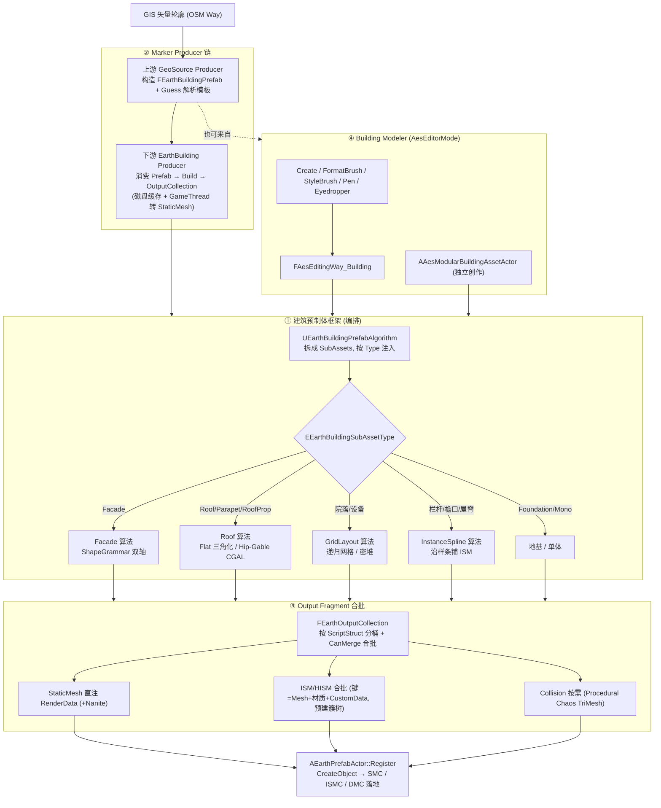

# 第 5 页 · 建筑 Prefab 完整案例内容底稿

> 这页用**一栋建筑**作为贯穿案例，讲清「一条建筑数据如何走完整套 EarthPrefab 流水线，变成场景里的建筑」。
> 区别于第 4 页（讲框架四大支柱的抽象），第 5 页要**落到建筑这一个具体管线**，按真实代码把四块讲透：
> ① 建筑预制体框架（总算法 + 4 类子预制体）② Building Marker Producer（消费者）③ Output Fragment（最终产物）④ Building Modeler（编辑器创作）。
> 所有事实均经专家组直读源码 + 主控 KB CLI 核证（commit `a69bc21`）。

---

## 0 · 当前第 5 页的问题

现版只有：一句「Fragment 是生成装配线」+ 三步装配清单（Building Fragment → SubAssets → Output Fragment）+ 三张浮动小卡（Facade / Roof / Mesh Output）。问题：

- **太糙、是占位草稿**：只点了三个名词，完全没有真实代码里的类、算法、数据流。
- **没讲清"建筑"这个案例**：建筑到底由哪些子预制体拼起来、谁去消费它、产物有哪些类型、美术怎么造——全缺。
- **没体现真实实现的精妙**：数据驱动编排、ShapeGrammar 立面、CGAL 屋顶、ISM 合批、磁盘缓存、编辑器笔刷——一个都没提。

---

## 1 · 一句话主张（Hero）

**一栋建筑的诞生：从一条 GIS 轮廓，到立面、屋顶、地基逐层装配，再合批成网格落地。**

副标题：建筑不是一个"建筑算法"硬生成的——它是**数据驱动的编排管线**：建筑总算法把一栋楼拆成立面/屋顶/女儿墙/地基子资产，各子预制体（Facade/GridLayout/InstanceSpline/Roof）各自生成几何，统一合批进 OutputCollection，由 Marker Producer 消费落地，并支持美术在编辑器里用笔刷直接创作。

---

## 2 · 四块主体内容（页面主线，按"一栋建筑走完整管线"串起来）

### ① 建筑预制体框架 — 数据驱动的两级编排（不是硬编码）

**核心认知（必须讲对）**：`UEarthBuildingPrefabAlgorithm` 不直接 `new` 立面/屋顶类，而是**编排器**——它读建筑的"子资产清单"，每个子资产携带一个 `UEarthPrefabAsset` 引用 + 一个类型，算法按类型注入数据后，递归调用**子资产自带的算法**。Facade/Grid/Spline/Roof 是被"资产引用"编排进来的叶子算法，不是编译期依赖。

- **总算法**：`UEarthBuildingPrefabAlgorithm`（`Source/EarthPrefab/Public/Prefab/EarthBuildingPrefab.h:34`，继承 `UEarthPrefabAlgorithm`）。
  - `ConfigureRequirements` 声明所需片段：`FEarthBuildingFragment` + `FEarthBuildingSubAssetsFragment` + `FEarthPrimitiveFragment`（建筑属性 + 子资产清单 + 轮廓几何）。
  - `EntityLoopBody` 逐栋建筑执行：确定性选色 → 预计算高度常量 → 遍历 SubAssets → 按类型注入父级 Transform + 覆盖 Fragment → `FEarthSubAssetInfo::Execute` 递归调度。
- **子资产类型** `EEarthBuildingSubAssetType`（`EarthBuildingFragment.h:11`）：`Facade`（立面）/ `Roof`（屋顶）/ `Parapet`（女儿墙）/ `RoofProp`（屋顶摆件）/ `MonoBuilding`（单体模型）/ `Foundation`（地基）/ `Other`。
  - 每种类型决定：父级 Transform 抬到哪（地基下沉 `-FoundationDepth`、立面起点 `MinHeightZ`、屋顶顶面 `HeightZ`）+ 注入哪种覆盖片段（立面色 / 屋顶色 / 高度 / 层数）。
- **递归调度核心**：`FEarthSubAssetInfo::Execute`（`EarthCommonFragments.cpp`）—— LOD 过滤 → 加载子 `UEarthPrefabAsset` → `Transform = 子 × 父` → `UpdateSeed` → 执行子资产 `GetDefaultAlgorithm()` → 输出 `Merge` 进同一 `OutputCollection`。

**四类子预制体（建筑的"零件库"，逐个讲）**：

| 子预制体 | 算法类（文件:行号） | 干什么 | 关键设计 |
|---|---|---|---|
| **Facade 立面** | `UEarthFacadePrefabAlgorithm`（`EarthFacadePrefab.h`） | 把一面墙按楼层 + 模块铺成窗/门/墙段 | **ShapeGrammar 双轴细分**：纵向 `DuplicateCrossSections` 分层(level)、横向 `SubdivideSegment` 按语法串分模块、符号选择器按朝向(正/侧/背)动态换符号；另有 `FacadeMesh` 直接挤墙网格的姊妹算法 |
| **GridLayout 网格** | `UEarthGridLayoutPrefabAlgorithm`（`EarthGridLayoutPrefab.h`） | 在轮廓内网格化铺资产（屋顶设备、院落） | `RecursiveGrid`（递归只选≤当前尺寸资产，收敛细分）/ `DensePack`（空间哈希 + OBB 紧凑放置）双模式；逐格做多边形内裁剪 |
| **InstanceSpline 实例样条** | `UEarthInstanceSplinePrefabAlgorithm`（`EarthInstanceSplinePrefab.h`） | 沿样条/边铺实例（栏杆、檐口、屋脊瓦） | 产出 ISM 实例化网格；`CustomDataPacker` 把 FeatureID 打进逐实例数据；按比例切段差异化处理转角模块 |
| **Roof 屋顶** | `UEarthFlatRoofPrefabAlgorithm` / `UEarthHipRoofPrefabAlgorithm`（`EarthRoofPrefab.h` / `EarthHipRoofPrefab.h`） | 生成平顶 / 坡顶 | 平顶：三角化 + 可选地块细分；坡顶：**CGAL 直骨架(Straight Skeleton)** 生成屋面，山墙(Gable)与四坡(Hip)共用算法，屋脊线**复用 InstanceSpline** 铺脊瓦；屋顶形态枚举 `EEarthRoofShape` 20+ 种（含 OSM 字符串映射） |

> 数据流一句话：**建筑 Entity → 总算法拆成 SubAssets → 按类型注入 → 子算法（Facade/Grid/Spline/Roof）各生成几何 → 合批进 OutputCollection**。

---

### ② Building Marker Producer — 谁来"消费"建筑预制体

建筑预制体生成出来后，由 **Marker Producer 链**驱动消费、缓存、落地。这是一条**两段链**：

1. **上游 · 生产并解析 Prefab**：`FAesBuildingGeoSourceMarkerProducer`（`AesMarkerSystem` 模块）
   - 把原始建筑矢量（OSM/GIS Way）转成 GeoSource，逐栋构造 `FEarthBuildingPrefab` + 各 Fragment（轮廓/FeatureID/GroupID/建筑属性/QuadKey）。
   - 调 `UEarthBuildingPrefabAlgorithm::Guess_Single`，按区域预制体库（`UEarthRegionalPrefabAssetLibrary`，QuadKey 选库）+ 实体类型 + 哈希匹配，**解析出该建筑该用哪套 PrefabAsset** 并回写 `PrefabAssetID`。
   - 地基深度规则：楼高:地基 ≈ 3:1；无颜色/黑色时回退色卡。

2. **下游 · 真正消费 Prefab → 产网格**：`FAesEarthBuildingMarkerProducer`（`AesEarth` 模块，继承 `FAesBuilderMarkerProducer`）
   - 取上游 GeoSource（含已解析的建筑 Prefab），经 `IAesBuildingBuilder::Build` 产出 `FEarthOutputCollection`。
   - **磁盘渲染缓存优先**：命中缓存（版本头校验 `NeedRebuild`）直接反序列化 OutputCollection，跳过重建。
   - `ConvertToStaticMesh` 在 **GameThread** 把 Output Fragment 转 `UStaticMesh`（UObject 约束 + 引擎退出防御）。

- **分流开关**：`bUseEarthPrefab` —— `true` 走 EarthBuilding（新，出 OutputCollection）；`false` 走旧版 `FAesModularBuilderMarkerProducer`（出 RenderResource）。
- **注册点**：全链在 `FAesBuildingPayloadManager` 构造函数装配（数据源 → GeoSource Producer → Mask → EarthBuilding/Modular），并串成依赖 DAG。

> 一句话：**上游把矢量变成"带 Prefab 的建筑"并猜出模板，下游消费 Prefab 出网格、写缓存、转 StaticMesh**。

---

### ③ Output Fragment — 建筑最终生成产物与特殊设计

所有产物统一抽象为 `FEarthOutputFragment`（`EEarthFragmentType::Output = 1<<3`），汇入 `FEarthOutputCollection`（`Source/EarthPrefab/Public/EarthCommonFragments.h`）。Collection 用 `TMap<UScriptStruct*, ...>` **按片段类型分桶**，桶内用 `CanMerge`/`Merge` **同合批键去重合并**。

**建筑主要产出的 Output 类型**：

| Output Fragment | 用途 | 特殊设计 / 优化 |
|---|---|---|
| `FEarthStaticMeshFragment` | 立面墙体、屋顶、地基等实体网格 | **BuildData 直注 RenderData**：顶点/Section 与引擎结构内存对齐，绕过 MeshDescription 管线直接灌 `FStaticMeshRenderData`；`SetNumUninitialized` 跳零初始化省 ~116B/顶点；**Nanite 失败自动回退**；`ReleaseBuildData` 渲染后即时释放；`CompactMaterialGroups` 剔除空材质槽 |
| `FEarthInstancedStaticMeshFragment`（ISM/HISM） | 窗、栏杆、檐口、屋脊瓦等重复实例 | **合批键** = StaticMesh + ComponentClass + 材质 + PrimitiveData + CustomData 维度一致，`MaxInstanceCount=4096` 上限防超大批；**HISM 离线预建簇树** `BuildTreeAnyThread`（任意线程）+ `AcceptPrebuiltTree` 跳过游戏线程建树；`CustomDataPacker` 把 FeatureID 等打进逐实例数据 |
| `FEarthDynamicMeshFragment` | 程序化动态网格（部分立面/旧路径） | 持 `FDynamicMesh3`，`CompactMaterialGroups` 剔空组，可 `ConvertToStaticMeshFragment` 转 SM |
| `FEarthCollisionFragment` | 碰撞 | `EEarthCollisionType`：None / Bounds / Mesh / **Procedural**；预建 `Chaos::FTriangleMeshImplicitObjectPtr` 直提物理线程；**按需分配**（仅 Procedural 才 Reserve 碰撞缓冲） |

- **合批本质**：分桶键 = 片段类型；桶内去重键 = 各子类自定义 `CanMerge`（材质 / 组件类 / CustomData）。`FindOrAdd` 让多个子资产**追加合并到同一网格**，减少 DrawCall。
- **落地链**：`AEarthPrefabActor::Build → Prepare → Execute（产出 Merge 进 OutputCollection）→ Register（PostProcess 注入 PrimitiveData/紧凑化/Nanite 开关 → CreateObject）`，逐桶创建 `StaticMeshComponent` / `InstancedStaticMeshComponent` / `DynamicMeshComponent` 并 attach。

> 一句话：**产物按类型分桶 + 同键合批，StaticMesh 直注 RenderData、ISM 离线预建簇树，Collision 按需分配，最终 Register 成真实组件**。

---

### ④ Building Modeler — 美术在编辑器里造建筑

> ⚠️ **重要更正**：任务说"Building Modeler 属于 Earth Modeler 框架"，但**代码上并非如此**。AesWorld 有**两套并行的编辑器框架**：
> - **`EarthModeler` 模块**（`UEarthModelerEditorMode`，基于 UE `InteractiveToolsFramework`）—— 当前主要做**道路**建模。
> - **`AesEditorMode` 模块**（自研"动作-命令"矢量编辑框架，基于 `UEarthActionBase` + `AAesVectorEditMode`）—— **建筑建模器在这里**。
> 页面应澄清这一点，避免沿用错误前提。

**Building Modeler = `AesEditorMode` 下 `Actions/Building/` 的一组 EditorAction**，给美术两条创作路径：

**路径 A · 在地球场景里交互编辑**（Building 图层，类 Photoshop 范式）：

| 工具 | 类 | 干什么 |
|---|---|---|
| 创建放置 | `UAesBuildingEditorAction_Create` | 预览 Actor + 鼠标定位 + 右键旋转轮廓 + 落点提交，实时 `BuildAsset()` 预览 |
| 选择 | `UAesBuildingEditorAction_Select` | 选中建筑实体 |
| **格式化笔刷** | `UAesBuildingEditorAction_FormatBrush` | 规整轮廓：`EAesBuildingFormatBrushType` = Rectangle(直角化) / CustomSnap(角度吸附) / Regularize(规整) / Smooth(平滑) / Align(对齐) / Bounds(包围盒)；**策略模式** + OctTree 球查批量改写 |
| 样式笔刷 | `UAesBuildingEditorAction_StyleBrush` | 刷立面/屋顶颜色、套预制模板 |
| 属性笔刷 | `UAesBuildingEditorAction_PropertyBrush` | 范围内批量改属性 |
| 属性钢笔 | `UAesBuildingEditorAction_PropertyPen` | 逐点绘制轮廓（含顺/逆时针纠正） |
| 属性吸管 | `UAesBuildingEditorAction_PropertyEyedropper` | 从已有建筑取样属性 |

- 工具均接 Command（`DECLARE_SIMPLE_COMMAND_CLASS`）+ `FAesTransactionBuffer` 的 **Undo/Redo**；提交后广播 `TAG_EDITOR_BUILDING_ADD` 消息驱动下游。

**路径 B · 脱离地球独立造一栋建筑**：`AAesModularBuildingAssetActor`（`AesAsset` 模块）
- 关卡里放一个 Actor，用 `SplineComponent` 画轮廓，填 `TagData`（楼层/高度/屋顶/颜色/类型），`BuildAsset()` 即时生成预览，可与库互导（`LoadFromLibrary` / `SaveToLibrary`）。
- **不依赖 `AAesEarth`** —— 坐实"单独使用建筑建模"的诉求。

**驱动底层算法**：编辑器配置 → `FAesEditingWay_Building`（矢量层）→ `AAesModularBuildingAssetActor.BuildAsset` → `FAesModularBuildingAsset::ComputePrefab`：
- `EAesBuildingPrefabType::Modular` → `ComputeModularBuilding`（立面/屋顶/女儿墙/地基/屋顶摆件子资产）
- `EAesBuildingPrefabType::Mono` → `ComputeMonoBuilding`（单体模型引用）

> 一句话：**美术用"创建+笔刷+钢笔+吸管"在场景里改建筑，或用独立 Actor 单独造一栋，编辑器配置经矢量层驱动底层预制体算法生成**。

---

## 3 · 端到端数据流（页面可做一张主图）

---

## 4 · 核心价值与魅力（页面收束，均经代码坐实）

1. **数据驱动编排，不是硬编码建筑算法** — 总算法只读子资产清单并按类型注入，Facade/Roof/Grid/Spline 由资产引用动态编排，换模板即换风格，零代码改动。
2. **ShapeGrammar 立面 + CGAL 屋顶** — 立面用纵横双轴形态语法参数化生成无限变体；坡屋顶用 CGAL 直骨架算真实屋面，屋脊线复用样条铺瓦。
3. **产物合批 + 直注渲染** — Output 按类型分桶 + 同键合批减 DrawCall；StaticMesh 绕过 MeshDescription 直注 RenderData，ISM 离线预建簇树，Nanite 失败自动回退。
4. **消费链有缓存、编辑器可创作** — Marker Producer 磁盘缓存 + 版本失效 + 并发；美术用笔刷/钢笔/吸管在场景里改建筑，或用独立 Actor 脱离地球单独造楼。

---

## 5 · 写稿避坑 / 与旧前提的关键差异

| 旧前提 / 旧讲稿 | 最新代码事实 | 处理 |
|---|---|---|
| "Building Modeler 属于 Earth Modeler 框架" | Building Modeler 在 `AesEditorMode`；`EarthModeler` 是另一套 InteractiveTools（道路）框架 | 页面**澄清两套框架并存**，建筑建模器归 AesEditorMode |
| "建筑算法直接生成立面/屋顶" | 总算法是**编排器**，子算法由子资产 `GetDefaultAlgorithm()` 动态决定 | 页面强调"数据驱动编排" |
| "一个 Building Producer" | 实为**两段链**：GeoSource Producer（产 Prefab + Guess）+ EarthBuilding Producer（消费 Prefab 出网格） | 页面画两段 |
| Output 只是 StaticMesh/Dynamic/Instance 三词 | 统一 `FEarthOutputFragment` + Collection 分桶合批；StaticMesh 直注 RenderData、ISM 预建簇树、Collision 按需 | 页面讲合批与优化 |
| `FEarthOutputCollection` 在 `EarthOutputTypes.h`（subagent 初判） | KB 核证在 `Source/EarthPrefab/Public/EarthCommonFragments.h` | 以 KB 为准 |

---

## 6 · 待澄清 / 未坐实（不阻塞页面，标注以防过度承诺）

- `OutputCollection → Marker Atlas / GPU hash / 距离 fade` 的渲染衔接点本轮未追到（属 AesMarkerSystem 通用渲染层）。
- `FEarthDynamicMeshFragment` / `FEarthCollisionFragment` 的 `CreateObject_Internal` 组件参数细节未逐行读。
- `FAesModularBuildingAsset::ComputeModularBuilding` 的 `.cpp` 算法实现（立面分层/屋顶）未逐行展开。

---

## 7 · 页面版式建议（对齐 04 的已验证版式）

- **复用** `04-earthprefab-ecs.html` 的 4:3 stage（1600×1200）+ glass panel + deck.css + `../shared/slide.js` 缩放。
- **建议结构**：
  - **Hero**：主张一句 + 副标（右侧 why 块放"数据驱动编排 · 两段消费链 · 编辑器可创作"）。
  - **主体**：一张**端到端管线主图**（建筑轮廓 → ① 编排拆 SubAssets → 4 子算法 → ③ 合批 → 落地），左/右副栏分别放 ② Producer 两段链 与 ④ Modeler 工具族。
  - 或四宫格：① 框架编排 / ② Producer 消费 / ③ Output 合批 / ④ Modeler 创作，每格 1 行定位 + 2–3 真实类名/能力点。
  - **底部**：4 句核心价值。
  - **footer**：`UEarthBuildingPrefabAlgorithm · FAesEarthBuildingMarkerProducer · FEarthOutputCollection · AesBuildingEditorAction` + 页码。

---

## 附 · 关键类速查表（页面 footer / 备查）

| 模块 | 类 | 文件:行号 |
|---|---|---|
| EarthPrefab | `UEarthBuildingPrefabAlgorithm` | `Source/EarthPrefab/Public/Prefab/EarthBuildingPrefab.h:34` |
| EarthPrefab | `UEarthFacadePrefabAlgorithm` | `Source/EarthPrefab/Public/Prefab/EarthFacadePrefab.h` |
| EarthPrefab | `UEarthGridLayoutPrefabAlgorithm` | `Source/EarthPrefab/Public/Prefab/EarthGridLayoutPrefab.h` |
| EarthPrefab | `UEarthInstanceSplinePrefabAlgorithm` | `Source/EarthPrefab/Public/Prefab/EarthInstanceSplinePrefab.h` |
| EarthPrefab | `UEarthFlatRoofPrefabAlgorithm` / `UEarthHipRoofPrefabAlgorithm` | `Source/EarthPrefab/Public/Prefab/EarthRoofPrefab.h` / `EarthHipRoofPrefab.h` |
| EarthPrefab | `FEarthOutputCollection` | `Source/EarthPrefab/Public/EarthCommonFragments.h` |
| EarthPrefab | `FEarthSubAssetInfo` | `Source/EarthPrefab/Public/EarthCommonFragments.h` |
| AesMarkerSystem | `FAesBuildingGeoSourceMarkerProducer` | `Source/AesMarkerSystem/Private/MarkerProducer/Vector/AesBuildingGeoSourceMarkerProducer.h` |
| AesEarth | `FAesEarthBuildingMarkerProducer` | `Source/AesEarth/Private/AesBuilding/Producers/Builder/AesEarthBuildingMarkerProducer.h` |
| AesEarth | `FAesBuildingPayloadManager` | `Source/AesEarth/Private/AesBuilding/AesBuildingPayload/AesBuildingPayloadManager.cpp` |
| AesEditorMode | `UAesBuildingEditorAction_*`（7 个） | `Source/Editor/AesEditorMode/Private/Actions/Building/` |
| AesEditorMode | `EAesBuildingFormatBrushType` | `Source/Editor/AesEditorMode/Private/Actions/Building/AesBuildingEditorAction_FormatBrush.h` |
| AesAsset | `FAesModularBuildingAsset` / `AAesModularBuildingAssetActor` | `Source/AesAsset/Public/Asset/AesModularBuildingAsset.h` / `AesModularBuildingAssetActor.h` |
| EarthModeler | `UEarthModelerEditorMode`（独立 InteractiveTools，主做道路） | `Source/EarthModeler/Private/EarthModelerEditorMode.h` |
